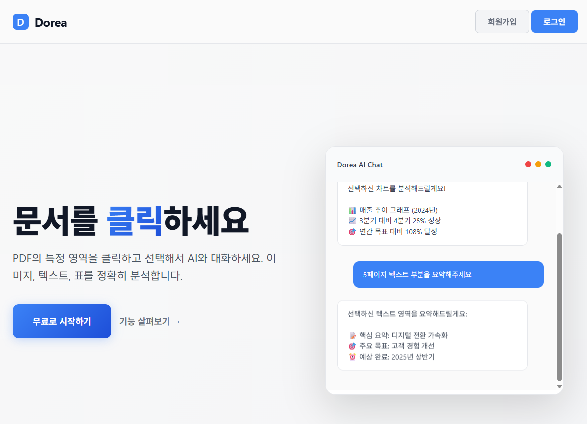
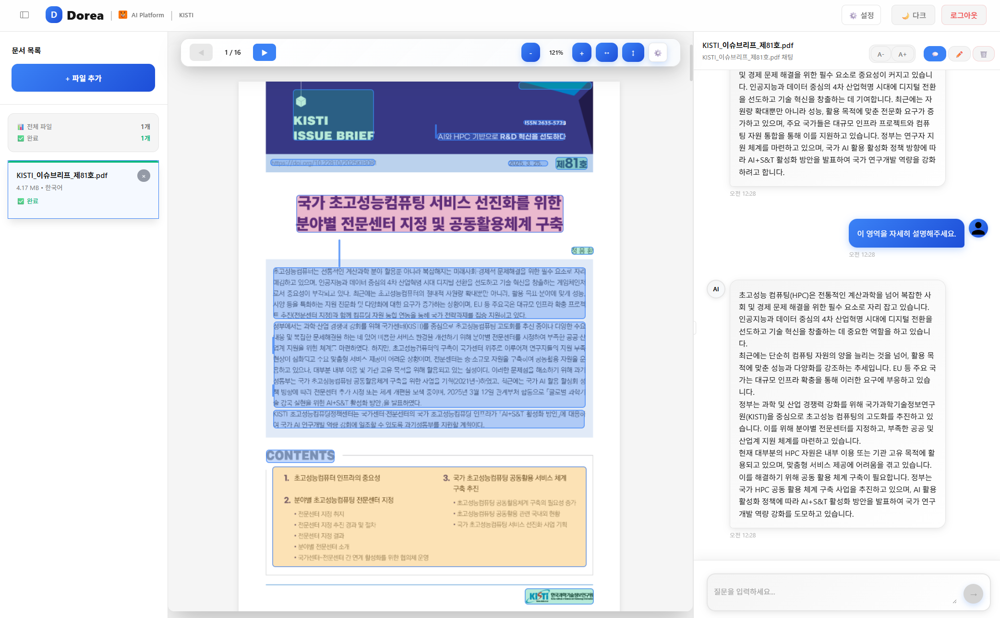

<div align="center">
  
  <h1>Dorea PDF AI</h1>
  <p>
    <strong>PDF 문서 분석 및 AI 대화 시스템</strong>
  </p>
  <p>
    
    
    
  </p>
</div>

## Language / 언어
- [한국어 🇰🇷](#한국어-버전) (Korean Version)
- [English 🇺🇸](README_EN.md) (English Version)

## 한국어 버전

## 개요

**RAG(Retrieval Augmented Generation) 기반 PDF 문서 분석 시스템**

PDF를 업로드하면 자동으로 레이아웃을 분석하고, 문서의 특정 부분을 클릭하여 해당 내용을 바탕으로 AI와 정확한 대화를 나눌 수 있습니다.

<div align="center">

### 시연 영상

[](https://youtu.be/xEo9D5tuc4E)

*음성: Generated using ElevenLabs (https://elevenlabs.io)*

</div>

<table>
<tr>
<td width="50%" align="center">

### 메인 화면


</td>
<td width="50%" align="center">

### AI 채팅 화면


</td>
</tr>
</table>

## 주요 기능

- **PDF 레이아웃 자동 분석**: 표, 이미지, 텍스트 영역을 자동으로 구분
- **다국어 OCR 지원**: 한국어, 영어, 일본어, 중국어 텍스트 추출
- **RAG 기반 문서 대화**: 문서 내용을 기반으로 정확한 AI 답변 제공
- **인터랙티브 UI**: 문서 영역 클릭으로 해당 부분에 대한 AI 대화 시작
- **다중 LLM 지원**: OpenAI GPT 및 로컬 LLM(Ollama) 선택 가능
- **실시간 스트리밍**: 응답을 실시간으로 확인
- **대화 기록 관리**: 모든 대화 내용 자동 저장

## 🚀 빠른 설치 가이드

### 1단계: Docker 설치

#### Windows 사용자
1. [Docker Desktop](https://www.docker.com/products/docker-desktop/) 다운로드 및 설치
2. 설치 후 재부팅
3. Docker Desktop 실행하여 시작 완료 대기

### 2단계: 소스코드 다운로드
```bash
git clone https://github.com/Byun11/Dorea-pdf-ai.git
cd Dorea-pdf-ai
```

### 3단계: 실행하기

#### 🟢 가장 간단한 방법 (추천)
```bash
# Windows 사용자 - 4가지 옵션 선택 가능
Dorea.bat
  # 1. 기본 실행 (외부망 필요)
  # 2. GPU 가속 지원 (외부망 필요) 
  # 3. 로컬 Ollama 연동 (내부망/폐쇄망 필수)
  # 4. GPU + 로컬 Ollama 연동 (내부망/폐쇄망 필수)

# Mac/Linux 사용자  
docker compose up --build
```

> **💡 참고**: 처음 실행 시 Docker 이미지 다운로드로 5-10분 소요될 수 있습니다.

#### 접속하기
- 웹 브라우저에서 **http://localhost:8000** 접속
- PDF 파일을 드래그해서 업로드
- 문서 분석 완료 후 영역을 클릭해서 AI와 대화 시작!

### 시스템 요구사항
- **메모리**: 8GB 이상 (16GB 권장)
- **디스크**: 10GB 이상의 여유 공간
- **네트워크**: 인터넷 연결 (초기 이미지 다운로드용)

### 종료하기
```bash
# Ctrl+C 누른 후
docker compose down
```

---

## 🔧 고급 설정 (선택사항)

<details>
<summary>GPU 가속, 로컬 모델 등 추가 옵션이 필요한 경우</summary>

### 다양한 실행 옵션

#### 소스 빌드 버전 (개발자용)
```bash
# 1. 기본 실행
docker compose up --build   

# 2. GPU 가속 지원 
docker compose -f docker-compose.yml -f docker-compose.gpu.yml up --build

# 3. 로컬 Ollama 연동
docker compose -f docker-compose.yml -f docker-compose.local-ollama.yml up --build

# 4. GPU + 로컬 Ollama 연동
docker compose -f docker-compose.yml -f docker-compose.gpu.yml -f docker-compose.local-ollama.yml up --build
```

#### 사전 빌드 이미지 버전 (배포용 - Dorea.bat와 동일)
```bash
# 5. 기본 실행 (외부망 필요)
docker compose -f docker-compose.hub.yml up

# 6. GPU 가속 지원 (외부망 필요)
docker compose -f docker-compose.hub.yml -f docker-compose.gpu.yml up

# 7. 로컬 Ollama 연동 (내부망/폐쇄망 필수)
docker compose -f docker-compose.hub.yml -f docker-compose.local-ollama.yml up

# 8. GPU + 로컬 Ollama 연동 (내부망/폐쇄망 필수)
docker compose -f docker-compose.hub.yml -f docker-compose.gpu.yml -f docker-compose.local-ollama.yml up
```

> **💡 참고**: 
> - **외부망 필요**: Docker Hub에서 이미지 다운로드
> - **내부망/폐쇄망**: 로컬 Ollama 서버가 port 11434에서 실행 중이어야 함

### 로그 확인
```bash
# 전체 서비스 로그
docker compose logs -f

# 개별 서비스 로그
docker compose logs -f pdf-ai
docker compose logs -f huridocs
docker compose logs -f ollama
```

</details>

## 🎯 사용 방법

1. **파일 업로드**: PDF를 드래그해서 업로드
2. **자동 분석**: 문서의 표, 이미지, 텍스트 영역을 자동으로 분석
3. **AI 대화**: 원하는 영역을 클릭하면 해당 내용 기반으로 AI와 대화
4. **대화 기록**: 모든 대화는 자동으로 저장됨

### 시연 영상

[](https://youtu.be/xEo9D5tuc4E)

*음성: Generated using ElevenLabs (https://elevenlabs.io)*

## 라이선스

Apache License 2.0

### 사용된 오픈소스

- **[HURIDOCS](https://github.com/huridocs/pdf-document-layout-analysis)** - PDF 레이아웃 분석 (Apache 2.0)
- **[Ollama](https://github.com/ollama/ollama)** - LLM 추론 엔진 (MIT)
- **[FastAPI](https://github.com/tiangolo/fastapi)** - 웹 프레임워크 (MIT)

### 관련 프로젝트

- **[SpectraBench](https://github.com/gwleee/SpectraBench)** - LLM 벤치마킹 스케줄링 시스템
- **[KONI](https://github.com/KISTI-AI/KONI)** - KISTI 과학기술정보 특화 언어모델
- **[KISTI-MCP](https://github.com/KISTI-AI/KISTI-MCP)** - KISTI Model Context Protocol 서버

## 지원

- 버그 리포트: [GitHub Issues](https://github.com/Byun11/Dorea-pdf-ai/issues)
- 이메일: [9722jayon@gmail.com](mailto:9722jayon@gmail.com)

## 개발자

- **변재연**: [9722jayon@gmail.com](mailto:9722jayon@gmail.com)
- **이용**: [ryonglee@kisti.re.kr](mailto:ryonglee@kisti.re.kr)

---

<div align="center">
  
  <br>
  <strong>KISTI 초거대 AI 연구센터 / AI 플랫폼팀</strong>
  <br>
  <sub>© 2025 KISTI Large-scale AI Research Center / AI Platform Team. All rights reserved.</sub>
</div>
